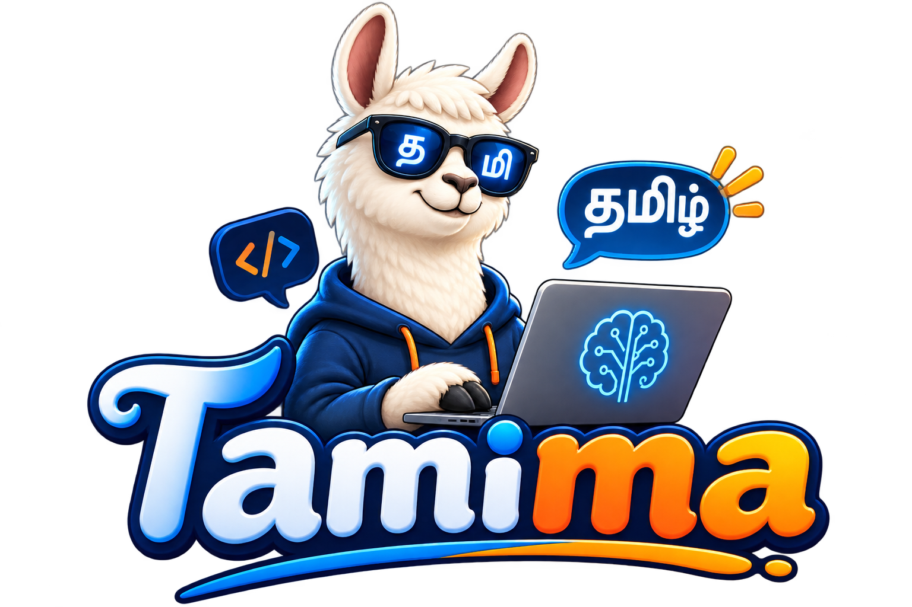

# Tamima



A Tamil-focused large language model family built on top of LLaMA 2. Tamima extends the LLaMA architecture with 16,000 additional Tamil tokens and applies LoRA-based training on a dedicated Tamil corpus to produce models that generate and comprehend Tamil text fluently.

---

## Models

| Model | Type | Training Data | Base | Parameters |
|-------|------|---------------|------|------------|
| Tamima 7B Base | Base | 12 GB Tamil corpus | LLaMA 7B | 7B |
| Tamima 13B Base | Base | 4 GB Tamil corpus | LLaMA 13B | 13B |
| Tamima 7B Instruct | Instruction-tuned | 145k instructions | Tamima 7B Base | 7B |
| Tamima 13B Instruct | Instruction-tuned | 145k instructions | Tamima 13B Base | 13B |

Quantized GGUF versions (Q4_K_M, Q5_K_M, Q8_0) are also available for all models.

---

## Benchmarks

TBD

---

## Running Locally

### Ollama

1. Install [Ollama](https://github.com/jmorganca/ollama).
2. Place the GGUF file and `config/ollama/Modelfile` in the same directory.
3. Create the model:
   ```bash
   ollama create tamima -f Modelfile
   ```
4. Run it:
   ```bash
   ollama run tamima
   ```

Optional Modelfile tweaks for your hardware:
```
PARAMETER num_thread 8
PARAMETER num_gpu 0
```

---

## Prompt Format

The instruction models expect this template:

```
{system_prompt}

### Instruction:
{your question or task}

### Response:
```

If additional context is needed:

```
{system_prompt}

### Instruction:
{your question or task}

### Input:
{context or reference material}

### Response:
```

---

## Datasets

- [Tamil Alpaca](https://huggingface.co/datasets/abhinand/tamil-alpaca) — Tamil translation of the Alpaca dataset
- [Tamil Alpaca Orca](https://huggingface.co/datasets/abhinand/tamil-alpaca-orca) — OpenOrca subset translated to Tamil
- [Tamil LLaMA Eval](https://huggingface.co/datasets/abhinand/tamil-llama-eval) — Evaluation set

---

## Important Notes

These models have not been detoxified. They can produce harmful or offensive content. Exercise caution when deploying them, especially in public-facing applications.

---

## Contributing

Issues and pull requests are welcome. If you spot a bug or have an idea for improvement, open a ticket.

---

## License

Source code and datasets: [GNU GPL v3.0](LICENSE)

The trained model weights inherit Meta's LLaMA 2 license. See [LLAMA2-LICENSE](LLAMA2-LICENSE) for full terms.

---

## Citation

```bibtex
@misc{rajacsp2026tamima,
      title={Tamima: A Tamil Language Model Based on Llama 2},
      author={Raja CSP Raman},
      year={2026}
}
```

---

